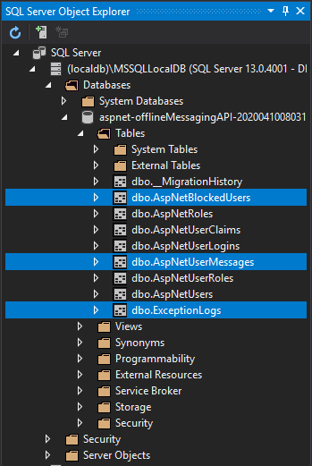

# How To Setup The Databases

SQL Files for the 3 additional tables are in this folder. The tables are:
* AspNetBlockedUsers
* AspNetUserMessages
* ExceptionLogs

One important issue here is identity framework can create different type of columns depending on the computer it is run. If foreign keys do not match with the sql files provided just modify the nonmatching columns in these fields. For example, the files have several columns as NVARCHAR (128) as foreign key refering to the identity generated table but under some circumstances identity will generate these columns as NVARCHAR (256) or NVARCHAR (512).

After making first call to the Identity framework, a database with multiple tables will be created for you. Here you need to add 3 more tables as shown in the picture below.

